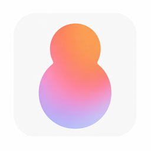

<div align="center">

<h1 style="margin: 6px 0 4px; font-weight: bold;">BabyLovable</h1>
<h3 style="margin: 0 0 8px;">基于 Serverless 云端多用户 Coding Agent · <a href="https://baby-lovable.vercel.app/">演示地址</a></h3>
<a href="https://ai-sdk.dev/docs/agents/workflow-agent#workflowagent"></a>
<a href="https://supabase.com/docs/guides/auth"></a>
<a href="https://supabase.com/docs/guides/realtime"></a>
<a href="https://www.daytona.io/"></a>
<a href="https://developers.cloudflare.com/browser-rendering/"></a>
<a href="https://nextjs.org/"></a>
</div>

## 核心能力

|              |                                                            |
| ------------ | ---------------------------------------------------------- |
| **Agent 编排** | Vercel AI SDK v7 `WorkflowAgent`                           |
| **持久执行**     | Workflow Serverless：挂了能续、失败重试、可观测性                         |
| **可恢复流**     | 刷新不断流，会话历史落库可回看                                            |
| **隔离沙盒**     | Daytona Sandbox + 自建镜像                                     |
| **资源调和**     | Lease + CAS，像 K8s 一样 observe → act，把 Serverless 下的沙盒并发串行管住 |
| **实时同步**     | Supabase Realtime 推送会话与 Preview 状态，前端不用轮询                  |
| **多用户隔离**    | Supabase Auth + RLS，认证授权和数据权限隔离                            |
| **自动 E2E**   | Cloudflare BrowserRun，Agent 自己开浏览器验结果                      |


其中「资源调和」与「实时同步」对应两套刻意拆开的控制面：**沙盒怎么在 Serverless 下安全收敛**，以及 **UI 怎么拿到会话/Preview 状态**。


<table>
  <tr>
    <td align="center" valign="top" width="50%">
      <p><strong>基础能力</strong></p>
      <video src="https://github.com/user-attachments/assets/df081939-f3ec-44fb-ba3f-13a68d9ce010" width="420" controls muted></video>
    </td>
    <td align="center" valign="top" width="50%">
      <p><strong>可恢复流</strong></p>
      <video src="https://github.com/user-attachments/assets/2eca82e8-ebeb-4bcb-b359-abd4bcb76b98" width="420" controls muted></video>
    </td>
  </tr>
  <tr>
    <td align="center" valign="top" width="50%">
      <p><strong>自动化浏览器测试</strong></p>
      <video src="https://github.com/user-attachments/assets/3d307aae-430f-4a4d-8659-d11ce6f7f050" width="420" controls muted></video>
    </td>
    <td align="center" valign="top" width="50%">
      <p><strong>持久工作流</strong></p>
      <video src="https://github.com/user-attachments/assets/1a0d6756-facb-4094-a883-4422a742bee9" width="420" controls muted></video>
    </td>
  </tr>
</table>

## 技术设计细节

### 资源调和：Lease + CAS，observe → act

#### 要解决的问题

部署在 Vercel 这类 Serverless 上时，**没有一台常驻的「沙盒管家」**：

- 同一次会话可能被多个 isolate 同时碰到：打开 Preview、Agent 工具、`after()` 后台 warm、FS attach 等
- 内存里的 Map 只在**当前 isolate** 有效，别的请求看不到
- Daytona 创建 VM / 起 `next dev` 又贵又不能并行搞两次（会双开、抢端口、状态互相覆盖）

所以不能靠「进程内锁」或「谁先调 API 谁管」，必须把协调落到**可共享的持久状态**上。

#### 设计：像 K8s 一样声明 desired，再收敛

核心在 `DaytonaRuntimeSnapshot`：只存 **intent（desired）** 和 **现状（observed）**，不让每个 API 直接「命令式地」起停沙盒。

```34:52:src/lib/sandbox/daytona/runtime-state.ts
export interface DaytonaRuntimeSnapshot {
  sessionId: string;
  revision: number;
  generation: number;

  desired: DaytonaDesiredState;
  observed: DaytonaObservedPhase;
  // ...
  leaseOwner: string | null;
  leaseExpiresAt: string | null;
}
```

`ensureDesiredState` 的路径是：

1. **写 desired**（例如 `preview-ready`）——调用方只说「我要这个状态」
2. **抢 Lease** ——同一时刻只有一个 writer 能改 Daytona
3. **observe → act 循环** ——看真实世界，再决定 create / start / stop / delete
4. 结束后 **释放 Lease**；抢不到的 isolate 只等收敛或等 Lease 过期再偷

```521:601:src/lib/sandbox/daytona/runtime-reconciler.ts
async function reconcileLoop(...) {
  while (Date.now() < deadline) {
    await renewRuntimeLease(sessionId, owner, LEASE_TTL_MS);
    let snapshot = await getRuntimeSnapshot(sessionId, null, { fresh: true });
    const observed = await observeRuntime(...);
    // ... merge observation into snapshot ...
    if (isDesiredSatisfied(snapshot)) return snapshot;
    const acted = await reconcileOnce(sessionId, snapshot, observed);
    // ...
  }
}
```

调用方也可以 `wait: false` 只提交 intent，由 `after()` 把 isolate 撑住做后台 reconcile（见 `preview.ts` 注释），这样 **Agent 主循环不用干等冷启动**。

#### 为什么是 Lease + CAS，而不是别的


| 机制                          | 作用                                |
| --------------------------- | --------------------------------- |
| **Lease（~45s TTL + renew）** | 单写者；holder 挂了会过期，别人可接管，避免永久死锁     |
| **CAS（**`revision`**）**     | 写前比对持久层版本；过期 L1 不能覆盖别的 isolate 的写 |
| **写永远对 durable 做 CAS**      | 注释写得很直白：L1 只是本进程缓存，**不能当真相源**     |


```1:6:src/lib/sandbox/daytona/runtime-store.ts
 * Daytona runtime store — durable snapshot + lease for single-writer reconcile.
 * ...
 * L1 `memory` is process-local (one serverless isolate). Writers always CAS
 * against durable state so a stale L1 cannot clobber another isolate's write.
```

竞态测试也是按这个假设写的：模拟「WebUI + Agent 两个 isolate 同时 `ensure(preview-ready)` → 只有 lease holder 真正 `createSandbox`」。

**一句话**：Serverless 下把「多请求并发」收成「一个租约持有者按 desired 调和」；CAS 保证跨 isolate 的状态写不错乱——所以 README 说「像 K8s 一样 observe → act，把沙盒并发串行管住」。

### 实时同步：Supabase Realtime，前端不轮询

#### 要解决的问题

Preview / Agent run / Browser Test 状态会频繁变。若前端一直 `GET` 拼状态，会：

- 打爆 host（每次现场拼 peek + app-test + run）
- 多 tab / 刷新后状态容易和服务器分叉
- 和「整行推送」的 Realtime 模型不匹配

#### 设计：命令与读模型分离

ADR 写在 `docs/ARCHITECTURE.md`：

- **写路径**：域更新成功后 `publishRuntimeUpdate`（UI 字段没变就不 bump `version`）
- **读模型**：唯一的 `SessionRuntimeProjection`（`run` / `preview` / `appTest` + 单调 `version`）
- **输送层跟 persist backend**：本地文件 → host SSE；Supabase → Realtime 表 `session_runtime_projection`

前端 `useSessionRuntime`：进页拉一次 `GET /runtime`，之后**整份 projection 替换**（用 `version` 门闸拒绝旧包），不再轮询。

```126:151:src/lib/session/runtime-query.ts
      const channel = supabase
        .channel(`runtime:${sessionId}`)
        .on(
          "postgres_changes",
          {
            event: "*",
            schema: "public",
            table: "session_runtime_projection",
            filter: `session_id=eq.${sessionId}`,
          },
          (payload) => {
            // ... applyProjectionIfNewer ...
          },
        )
```

Daytona 侧 CAS 成功后，会从 snapshot **投影**出 preview 再 publish——Lease 只续租、UI 字段没变时不会刷屏：

```155:156:src/lib/sandbox/daytona/runtime-store.ts
  // Publish UI projection only when derived preview fields change (lease-only CAS no-ops).
  void publishPreviewFromSnapshot(saved, ownerId);
```

刻意不做的：客户端自己 merge `preview.updated`、再加一层 Ably/Redis、把 chat token 塞进这条通道（chat 仍走 Workflow SSE）。

**一句话**：沙盒真相在 Daytona runtime snapshot；UI 只订一份投影。云端用 Postgres Realtime 推整行，本地用 SSE 等价——所以「前端不用轮询」。

### 两者怎么串起来

```
Agent / Preview API
    → ensureDesiredState(desired)     // 声明意图
    → Lease + observe/act             // 单写者收敛沙盒
    → upsertRuntimeSnapshot (CAS)
    → publishRuntimeUpdate            // 投影到 SessionRuntimeProjection
    → Supabase Realtime / SSE         // 前端整份替换
```

**资源调和**管的是「多 isolate 别把沙盒搞炸」；**实时同步**管的是「UI 及时、一致地看见结果」。前者是控制面，后者是读模型推送——拆开是为了让 Serverless 并发和前端体验各自用合适的原语，而不是用轮询或进程内状态硬扛。

## 工程落地方法

开发体验优先：vercel cli , supabase cli 

可观测性驱动开发：CLI Agent 模式不依赖 WebUI 调试、本地沙盒兼容层不依赖远程沙盒服务、纯文件持久化系统不依赖 DB、不依赖 Docker、完整系统可以在工程项目内 All-in-one启动运行和调试Debug。方便 Cursor 编码 Agent 做端到端自回归。

AI Coding 方法： 编码工作由 Cursor 完成；90% 工作使用普通模型完成，如 Composer2.5、Grok 4.5；复杂任务使用高级模型 GPT 5.6-Sol、Claude Sonnet 5（复杂任务是指：架构设计Plan、  复杂模块的 Review 和 Debug 工作）；方案调研工作如架构选型等是和 Genspark Agent一起完成；

## 更多功能规划

Agent Runtime 治理：长上下文治理、工具结果压缩等
代码产物持久化：云端版本控制，接入 Freestyle Git和 Github 双向同步
产品体验优化：UI/UX等优化

## 文档地图


| 文档                                                                                 | 读者      | 内容                                    |
| ---------------------------------------------------------------------------------- | ------- | ------------------------------------- |
| [docs/ENGINEERING.md](./docs/ENGINEERING.md)                                       | 关注工程思维  | 阶段划分、文件优先、CLI 自回归                     |
| [docs/ARCHITECTURE.md](./docs/ARCHITECTURE.md)                                     | 关注选型    | WorkflowAgent / Daytona / Browser Run |
| [docs/DATA-MODEL.md](./docs/DATA-MODEL.md)                                         | 关注数据    | 会话 vs 代码真相源、状态机                       |
| [docs/ROADMAP.md](./docs/ROADMAP.md)                                               | 关注完成度   | Done / Not done / Next                |
| [docs/usage/usage-events-2026-07-14.csv](./docs/usage/usage-events-2026-07-14.csv) | 关注用量    | 本仓库 Cursor Token 明细                   |
| [AGENTS.md](./AGENTS.md)                                                           | 跑 Agent | 操作手册                                  |


