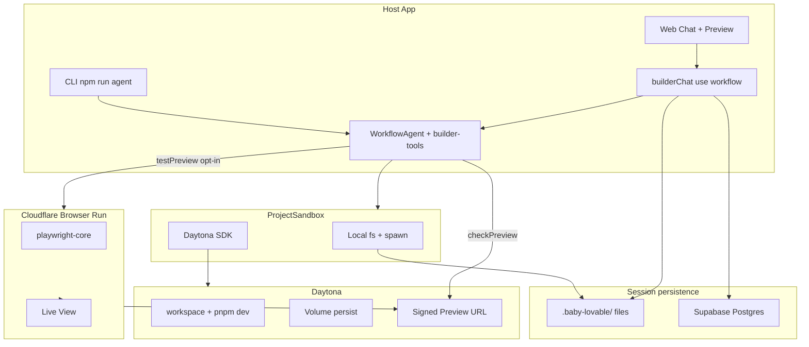

# 核心架构与关键取舍

> ADR 风格说明。工程节奏见 [ENGINEERING.md](./ENGINEERING.md)；数据流见 [DATA-MODEL.md](./DATA-MODEL.md)。

## 系统鸟瞰



---

## 1. Vercel AI SDK + WorkflowAgent，而不是 Redis 队列

### 选择了什么

- `ai@7` + `@ai-sdk/workflow` 的 **`WorkflowAgent`**
- Workflow DevKit：`'use workflow'`（整轮聊天）+ `'use step'`（可重试子步骤）
- Web：`start(builderChat, …)` → run 持久化 → `WorkflowChatTransport` 续流
- CLI：直接 `agent.stream()`（同一 Agent 定义，跳过 durable 运行时）

关键路径：

- `src/workflow/builder-agent.ts`
- `src/workflow/builder-chat.ts`
- `src/tools/builder-tool-steps.ts`

### 为什么不用自建 Queue（Redis / Bull / SQS）

| 需求 | Workflow DevKit | 自建队列 |
| --- | --- | --- |
| 多分钟 Agent turn + tool loop | 一等公民 | 要自己拆 job、存中间态 |
| Token 流式给浏览器 | `writable` / run readable 原生 | 要桥接 SSE + offset |
| 刷新后续看同一轮 | `getRun(runId)` + startIndex | 要自建续流存储 |
| Tool 失败重试 | `'use step'` | 手写幂等与重试 |
| 与 Vercel 部署模型 | 官方一体 | 额外运维 |

**取舍**：绑定 Vercel Workflow 生态，换「少写状态机」。若未来要多云队列，可把 `'use step'` 里的副作用保持纯函数边界，再换调度层——当前刻意不提前抽象。

### 和「普通 ToolLoopAgent」的差别

内存里的 tool loop 适合短请求；本产品一轮可能：装依赖、等 preview、多次改文件、可选浏览器测——**崩溃恢复与续流是产品需求**，不是锦上添花。

---

## 2. Daytona，而不是 E2B（及同类）

### 选择了什么

- `@daytona/sdk` 实现 `ProjectSandbox`
- 双盘：快速 workspace 跑构建；Volume（S3-backed FUSE）只做源码持久化
- Snapshot：构建时预装 git + 系统 pnpm + starter + `node_modules`（`npm run build:daytona-snapshot`）；冷启动不再 seed 源码、不再 runtime 装依赖，直接 `pnpm dev`
- `getPreviewLink` / signed embed URL：给 iframe 与 Browser Run

关键路径：`src/lib/sandbox/daytona/**`、`src/lib/sandbox/local/**`

### 为什么倾向 Daytona（基于实现需求，而非品牌偏好）

Agent 需要的不是「能跑一段 Python」的 notebook，而是：

1. **文件系统 API**（读写/搜索，与 local 对称）
2. **进程 API**（`pnpm` / `next dev`）
3. **Git API**（每 turn checkpoint）
4. **可公网访问的 Preview**（否则云端浏览器测不到）
5. **会话级持久化**（sandbox 可停，代码不能丢）
6. **Snapshot**（否则每次 `pnpm install` 拖垮体验）

Daytona 在同一 SDK 表面覆盖上述能力，使 `factory.ts` 可以 `local | daytona` 切换而不改 tools。

### 相对 E2B 等方案的取舍（诚实版）

| 维度 | 本项目立场 |
| --- | --- |
| 未做双后端适配 | 面试周期内只深做一条远程路径，避免两套 preview/volume 语义 |
| E2B 优势场景 | 短生命周期 code exec、模板丰富；本项目更偏「长存活 dev workspace」 |
| 成本 / 配额 | Daytona idle stop + 配额错误 surfacing；未做完整计费产品 |
| 复杂度 | Volume FUSE 不适合直接跑 build → 必须「双盘」——这是有意设计，不是意外 |

**若重选**：仍会优先「preview URL + fs/git/process 一体」的厂商；接口层已预留，换后端主要是 provider 工作量。

---

## 3. Cloudflare Browser Run：创新点与边界

### 问题

`checkPreview` 只能证明「编译通过 / HTTP 非 5xx」，不能证明「按钮能点、表单能提交」。本地 Playwright 又看不到 Daytona 外的用户场景，且 Web 评审需要**可见**的测试过程。

### 设计

```
Daytona signed Preview URL
        → Cloudflare Browser Run（远程 Chromium，CDP）
        → playwright-core 执行 scripted / heuristic 步骤
        → Live View URL（聊天侧 PiP）+ durable run status
```

要点：

1. **硬约束**：仅 `sandboxMode=daytona`——CF 访问不到 localhost。
2. **Opt-in**：system prompt 禁止默认调用；UI「Auto Test」或用户明确要求才跑——控制费用与延迟。
3. **Serverless 友好**：App Test 状态始终写 durable store（文件或 Supabase），避免 Vercel 多 isolate 内存漂移。
4. **双模式交互**：有 `actions` 走脚本；无则启发式（如 todo 表单 / 通用 CTA）。

关键路径：`src/lib/browser-run/**`、`testPreview` in `builder-tools.ts`

### 为什么说是「亮点」而不是「又接了一个 SaaS」

- 把 **远程沙盒 Preview** 与 **远程浏览器** 拼成闭环，而不是在 host 进程里假测
- Live View 让「Agent 在测」对用户可见，补齐 UX
- 与编译门控分层：默认便宜、增强显式——产品策略清晰

### 边界

- Local sandbox 无法走此路径（文档与 UI 需诚实说明）
- Heuristic 覆盖有限；复杂应用仍需脚本 / 未来断言 DSL
- 依赖 CF 账号权限（Browser Rendering - Edit）

---

## 4. Sandbox Interface：环境可替换

```ts
ProjectSandbox {
  fs: SandboxFileSystem
  process: SandboxProcessRunner
}
```

- Local：Node `fs` + `spawn`
- Daytona：SDK fs / process

上层 tools **只依赖接口**。这是渐进加 Daytona 时没有重写 Agent 的前提。

额外策略：

- `command-policy.ts`：收窄可执行命令
- `protected-paths.ts`：收窄可写路径
- Preview 生命周期归 `local/app-server*.ts` / `daytona/app-server*.ts`，不归模型

---

## 5. 验证策略：两级门控

| 工具 | 级别 | 何时 |
| --- | --- | --- |
| `checkPreview` | L1 HTTP 就绪 | 首轮未 ready、装依赖/改配置、大改、或 write/edit 带回 `compileError` 时；小改依赖 HMR。编译诊断在 write/edit 的 `compileError`，不读 devlog |
| `testPreview` | L2 UI 冒烟 | 用户明确要求或 Auto Test；需 Daytona + CF |

不把 L2 设为默认，是为了避免：慢、贵、脆、在未就绪 Preview 上产生噪声失败。

---

## 6. 其他刻意不做的事

| 不做 | 原因 |
| --- | --- |
| 开放任意 shell | 安全与可复现性 |
| Agent 管理 `.next` | 缓存归平台；坏了用 `checkPreview({ restart: true })` |
| Web 上选 sandbox | 减少错误组合；用 env 固定部署形态 |
| 自建消息总线 | Workflow 已覆盖主路径 |

---

## 7. ADR — SessionRuntimeProjection（命令 / 状态分离）

### 选择了什么

- **唯一读模型** `SessionRuntimeProjection`（`run` / `preview` / `appTest` + 单调 `version`）
- 写路径在域更新成功后 `publishRuntimeUpdate`（UI 字段无变化不 bump）
- 输送层**跟 persist backend**，不跟「是否 laptop」：
  - file store → host `GET /api/sessions/:id/events` SSE
  - Supabase（本机连云或 Vercel）→ Realtime `session_runtime_projection`
- 前端 `useSessionRuntime`：进页 `GET /runtime`，其后整份 projection 替换（`version` 门闸）；React Query 作缓存

关键路径：`src/lib/session/runtime-projection*.ts`、`runtime-query.ts`、`/api/sessions/[sessionId]/runtime|events`

### 为什么不用「每次 GET 拼三域」或客户端域级 patch

| 方案 | 问题 |
| --- | --- |
| GET 现场拼 peek + app-test + run | host 仍是高频聚合器；与 Realtime 整行推送不契合 |
| 客户端 `preview.updated` 手工 merge | 易与服务端真相分叉；Realtime 天然是整行 |
| Ably / Redis / Vercel WS | 多一层运维；本阶段不需要 |

### 刻意不做

- 完整 event log / replay
- 把 chat token 并进 runtime 通道（仍走 Workflow SSE）
- Sandbox / Daytona / Browser Run 直推浏览器

---

## 8. 待细化大纲钩子

- [ ] 是否补「与 Lovable / v0 / Cursor 的定位对比」半页？
- [ ] WorkflowAgent 是否画「一次 chat turn 的 sequence diagram」？
- [ ] Daytona CAS 抢 sandbox id、cold isolate adopt 是否单独成「生产踩坑」附录？
- [ ] Browser Run 是否放一张 Live View 截图 / 录屏链接（面试材料）？
- [ ] 是否写明模型默认 `minimax/minimax-m3` 与换模型方式？
