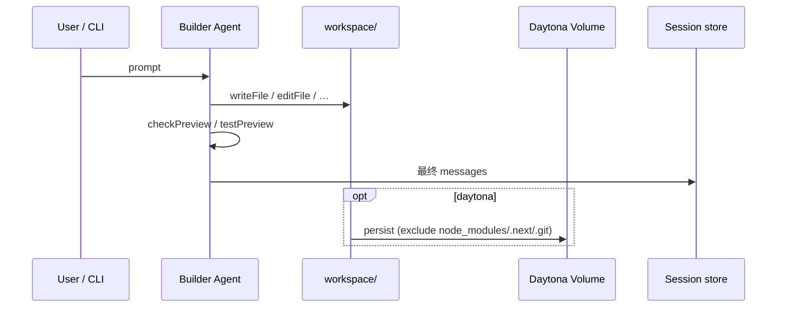

# 数据模型：真相源与状态流转

> 会话历史、代码、预览、测试状态如何分工，以及一次 turn 里数据怎么走。

## 1. 分层真相源（Core Idea）

本系统刻意 **不把所有东西塞进一张表**，而是按变更频率与语义拆分：

| 层 | 真相源 | 存什么 | 不存什么 |
| --- | --- | --- | --- |
| **对话与会话元数据** | Local：`session.json` / Prod：Supabase `sessions` | UIMessage 历史、标题、runStatus、sandboxMode、daytonaSandboxId… | 源码正文 |
| **流式中间态** | `draft.json` / `session_drafts` | 进行中的 assistant 草稿（可恢复） | 最终历史（完成后合并再删） |
| **代码** | `workspace/` 工作树 | 生成的 Next 应用源码 | 聊天文本 |
| **远程代码副本** | Daytona Volume（per-session subpath） | workspace 快照（排除 node_modules/.next/.git） | 运行态 |
| **预览运行态** | 进程内 Map +（Daytona）可 adopt 的 sandbox id | port、preview URL、installing/ready | 长期归档 |
| **App Test 运行态** | `app-test-status.json` / `session_app_test_status` | Live View、进度、结果摘要 | 与 messages 同行更新（避免互相覆盖） |

一句话：

- **DB / session 文件** = 对话与编排状态的真相源  
- **Workspace 工作树** = 代码的真相源  
- **Volume** = 远程场景下代码的持久化后端

---

## 2. 会话记录结构（逻辑模型）

```text
Session
  id, title, userId?
  sandboxMode: local | daytona
  runStatus: idle | pending | running | completed | failed | cancelled
  lastRunId?
  messages: UIMessage[]          # 含 tool-call / tool-result parts
  daytonaSandboxId?
  volumeSubpath?
  createdAt, updatedAt
```

消息是 **AI SDK UIMessage** 形态：用户文本、assistant 文本、工具调用与结果都在同一时间线里——便于 CLI / UI / 评审直接阅读「Agent 做了什么」。

---

## 3. 代码与 workspace 流转



要点：

1. **工作树即真相源**：Agent 直接改 `workspace/`，不再做 turn 边界 git commit。
2. **Bootstrap**：Daytona 新沙盒若 workspace 空，可从 Volume restore。
3. **导出**：sandbox 打包为 zip（local zip 尚未实现）。

这样评审可以问：「代码从哪来？丢了怎么找？」——答案是 workspace（+ Volume），而不是「在某个 JSON 字段里」。

---

## 4. 一次 Web Chat Turn 的状态机

```text
idle
  │ POST /chat（先 persist 含最新 user 消息）
  ▼
pending / running
  │ Workflow start(builderChat)
  │ 后台 materialize draft（~150ms 节流）
  │ 客户端 WorkflowChatTransport 读流
  │
  ├─刷新──► resolveSessionRunState(getRun)
  │         仍 active → 续流；已结束 → 调和 messages
  ▼
completed | failed | cancelled
  │ saveSessionMessages（优先匹配 runId 的 draft）
  │ 删除 draft
  ▼
idle
```

CLI 更简单：同步跑完 → `replaceMessages` →（one-shot）停 local preview。

---

## 5. Preview 与 App Test 为何单独存

### Preview

- Local：本机端口（如 3200+）上的 `pnpm dev`，状态主要在 host 内存；进程可成为 orphan → `npm run cleanup-previews`
- Daytona：preview URL 与 sandbox 绑定；Vercel **冷 isolate** 内存空时，靠 `session.daytonaSandboxId` **adopt** 已有 sandbox，避免「URL 分裂」

### App Test

- 与 `sessions.messages` **分表/分文件**，避免测试进度高频写与聊天大 JSON 互相覆盖
- Live View / running 状态必须 durable，否则 PiP 在另一 isolate 上看不到

---

## 6. Local vs Supabase：同一语义，两套介质

```text
                  store.ts / draft-store.ts / app-test-status-store.ts
                                    │
              ┌─────────────────────┴─────────────────────┐
              ▼                                           ▼
        store-local.ts                             store-supabase.ts
     .baby-lovable/**                              Postgres + RLS
```

切换条件见 `isLocalFileStorageMode()`（`BABY_LOVABLE_LOCAL_MODE` 或未配置 Supabase）。

---

## 7. 「DB vs Workspace」决策表（面试可用）

| 问题 | 答案 |
| --- | --- |
| 用户昨天说了什么？ | Session messages |
| 应用现在长什么样？ | `workspace/` 工作树 |
| 上一轮 Agent 改了啥？ | 该 turn 的 tool parts |
| 远程机器重启后代码还在吗？ | Daytona Volume restore + 再起 sandbox |
| 流式说到一半刷新？ | draft + lastRunId 续流 |
| 源码要不要进 Postgres？ | **不要**（体积、工具链都不合适） |
| 聊天要不要只放在 workspace？ | **不要**（查询、RLS、草稿、run 状态不适合） |

---

## 8. 待细化大纲钩子

- [ ] 是否画「失败 turn / cancelled」的补偿与残留 draft 处理？
- [ ] UIMessage 体积增长与裁剪策略（目前未做）是否列入已知债？
- [ ] 多用户 `userId` 路径与 local `userId: null` 的安全边界说明？
